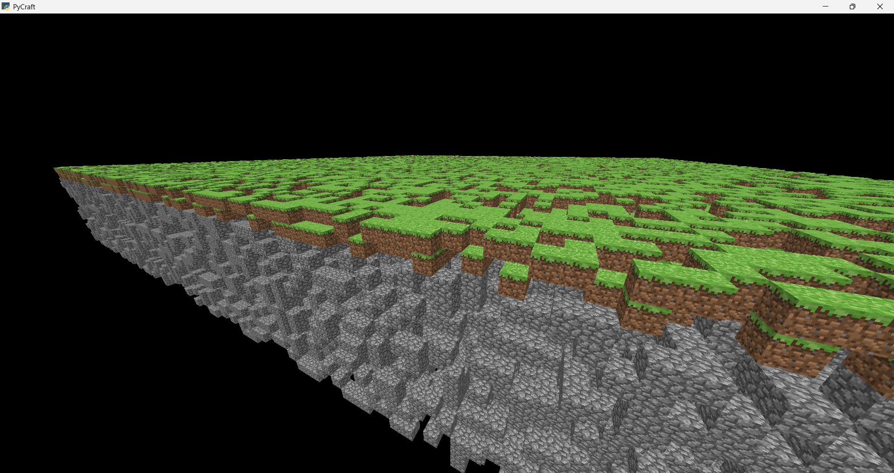
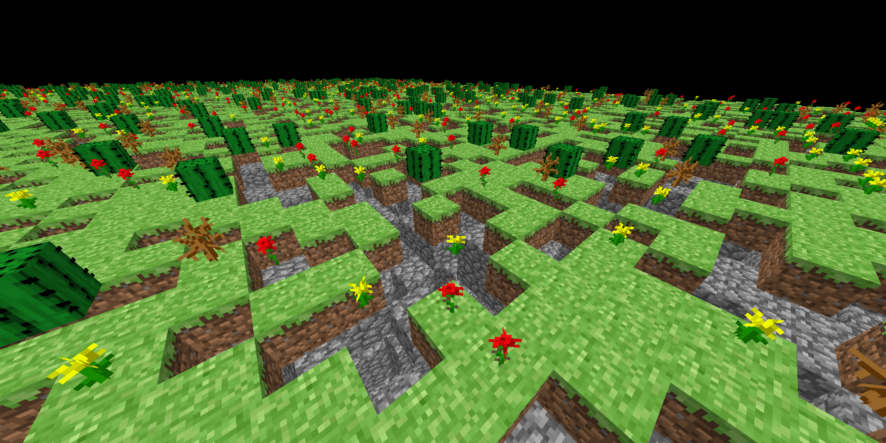

# PyCraft
An exercise in **Python** programming and rendering which creates **an interactable world in the style of Minecraft**.
It uses ctype functionality to use **C** variables and **OpenGL** to handle rendering.

*This project was originally created by* https://github.com/obiwac *on the YouTube series located at*
https://www.youtube.com/playlist?list=PL6_bLxRDFzoKjaa3qCGkwR5L_ouSreaVP.

## Table of Contents

0. Setup and Requirements
1. Files in this Program
2. How I Explain the Code
3. Tools Used

## 0. Setup and Requirements

This is the setup procedure I followed for this project.

You need Python to be installed on your device - I had version 3.13.5.

The graphical library I used is **pyglet**. You can install it in the terminal using *pip*, the standard package manager for Python. Install pyglet and update pip below:

    pip install --user pyglet
    python -m pip install --upgrade pip

Test your installation using these lines. It should not throw errors:

    python
    import pyglet
    exit()

I used **Visual Studio** and **VSCode** to develop the code.

In order to make the shaders, I had to install **OpenGL**. The Open Graphics Library is a cross-platform API for vector graphics rendering. We need this for more complex graphics. *Pyglet has OpenGL functionality already, but I wanted to be safe.* To use it with Python, use:
    
    pip install PyOpenGL

I had to install **GLSL Syntax** for VS Code to apply syntax highlighting to GL Shader Language files. These shaders are essential for this project.

## 1. Files in this Program

### main.py

The file from which the game is run. Includes the pyglet Window class, which we use to display our game. When the Window is created, we initialize our game world and shaders. The Window will draw our graphics every frame. We also schedule an interval, here set to 60FPS, at which we check and update our camera position. Also contains the key controls for camera movement.

### world.py

Defines all block types present in the simulation. Creates a dictionary of chunks, the subdivisions of our world which are composed of block groups. Each chunk is mapped to a 3-tuple of (x,y,z) coordinates. Can additionally take the world space coordinates of a block and locate its relative position within its chunk, so that the chunk mesh can be edited. Calls the draw method of selected chunks when called by main.py.

### chunk.py

Creates a unified mesh composed of a group of blocks. Also contains an array of subchunks which can be accessed for speedier rendering when a single block is edited in the chunk. Each chunk mesh has its own Vertex Array Object (VAO), three Vertex Buffer Objects (VBOs) for vertices, textures, and shading, and an Index Buffer Object (IBO) for accessing the vertices. There is an array of values associated with each of the latter four. When the chunk mesh is updated, the chunk iterates through each block, adding its values and information to the corresponsing arrays. Those arrays are then loaded back into the memory objects. Each chunk has a draw function which will render the mesh.

### subchunk.py

Creates a unified mesh composed of a small group of blocks. Subchunks are contained in a list in each chunk. Contains functions for rendering only the block faces which touch air. The blocks each subchunk can access are found by calculating which blocks fall within a certain area of the parent chunk.

### block.py

Contains the block class, which stores all data related to a block type. Each block has a name, a list of faces and their associated textures, and arrays for vertex positions, vertex indices, texture coordinates, and shading coordinates. A single block can be rendered by loading all of these arrays into the appropriate memory objects. For efficiency, the game instead combines the array information of multiple blocks and then draws them at the same time in a chunk.

### texture_manager.py

Formats all textures present in the game. Creates a 3D texture array of unique textures which are accessible by using the z coordinate as the index of the texture. New blocks interact with the manager to ensure the accessibility of their textures by the shader.

### matrix.py

Contains the implementation of matrices. A matrix is a set of values we can use to transform, scale, or rotate vertices to simulate motion. Our camera uses multiple matrices multiplied together. This will handle moving rendered objects across the screen, updating the render content to include only what is visible to our camera, and creating a depth of field effect. In reality, our camera does not move, but the scene moves around our static viewport. Matrices allow the scene to be transformed in a way that convincingly simulates a first person perspective.

### camera.py

Creates and updates the ModelViewProjection matrix, which is responsible for updating the scene to match our movement. Contains coordinates for position, rotation, and inputs for changing those values every update. The MVP matrix is then passed to the shader to render our graphics with viewing position and angle taken into account.

### hit.py

Handles raycasting - a theoretical ray, q, is created extending from the camera. Allows us to detect which block we are looking at, which can be used to place and destroy blocks at certain locations in the world.

### shader.py

Creates a shader program which is used for modifying our plainly drawn faces, allowing for color, texture, and movement to be applied to them. The shader program consists of multiple shaders, each of which is linked to a GLSL shader file and contains its own memory buffer. The two shaders in our shader program are a vertex shader for moving vertices and a fragment shader for colorizing screen fragments.

### vert.glsl

Responsible for integrating the matrix to modify the scene's vertices. Takes in all vertex positions, texture coordinates, and shading values, and interpolates between them to allow the fragment shader to color them at their new position.

### frag.glsl

Takes in the interpolated data from the vertex shader outputs new screen colors. It is able to render textures to faces using a texture sampler which is passed to the shader as a uniform variable. 

### models/cube.py

A list of numerical values for blocks. They include the relative positions of vertices and a list of indices so that vectors can be drawn between them to form the renderable triangles. They also include the relative texture and shading coordinates. These coordinates will ultimately be modified by factoring in the world space position of the block later during the rendering process.

### models/plant.py

A list of numerical values for creating two faces which intersect in a cross pattern, rotated 45 degrees on the xz plane.

### models/cactus.py

Creates a block out of faces which are slightly smaller than in cube.py.

### textures folder

Contains a collection of 16x16 textures which are assigned to different block types in world.py.

## 2.  How I Explain the Code

## Graphics

In this program, we are essentially rendering **vectors** which run from the origin to a **vertex**. These collections of *vertices* form shapes together. In this program we render Minecraft's squares using two **triangles**, since a triangle *is the simplest planar shape* that can be created. We verifiably know that *all vertexes in a triangle are co-planar*. This simplifies calculation.

As shown in the image below from Autodesk, it is possible for squares to be rendered using non-planar vertices. The same non-planar, folded square could be rendered using two flat triangles which are more consistent and easier to render.

**Vector graphics** create images directly from mathematical computations of geometric shapes. This is exactly what we need for 3D rendering blocks or, more accurately, *voxels*, where the mathematical information of the cubes can be recorded with accuracy. However, since computer monitors use **raster** graphics, where images are created from a set of pixel colors, our *vector graphics* must undergo **rasterization** to convert our mathematical information to a set of pixels.

## Memory

We start with the following to manage the **memory for rendering.** The descriptions come from 
https://developers-heaven.net/blog/vertex-buffers-and-vertex-arrays-sending-geometry-to-the-gpu/:

- Vertex Array Objects (VAOs): Allow switching between sets of vertex data and attribute configurations. It holds references to the vertex buffers and the index buffer rather than actual data.
- Vertex Buffer Objects (VBOs): Memory regions on the GPU where you store vertex data, such as positions, normals, and texture coordinates. **Multiple VBOs may be used to store different sets of vertex data.** In this project, we use VBOs for:

        - Vertex Positions for rendering shapes
        - Texture Coordinates for mapping textures onto rendered faces
        - Shading Values for coloring different faces darker or lighter

- Index Buffer Objects (IBOs): An array of indices which map to vertices in a vertex buffer. This allows us to access vertex coordinates with an index, which can be reused if mutiple vectors need to be drawn from a single vertex.

## Drawing

For example, to draw a square, we need four vertices to load into the vertex buffer object. These vertices are 3-tuples of *x, y, and z coordinates.*

Vertices:

|   x  |   y  |  z  |    Vertex    |
|------|------|-----|--------------|
| -0.5 |  0.5 | 1.0 |   Top Left   |
| -0.5 | -0.5 | 1.0 | Bottom Left  |
|  0.5 | -0.5 | 1.0 | Bottom Right |
|  0.5 |  0.5 | 1.0 |  Top Right   |

We will then create a list of *indices* to draw which *match to our vertices.* This is loaded into the index buffer object. You can see that we are reusing some of the indices, since we have a vertex which serves as the starting point for more than one vector.

Indices:

| Index |    Vertex    | Triangle |
|-------|--------------|----------|
|   0   |   Top Left   |    •     |
|   1   | Bottom Left  |    ↓     |
|   2   | Bottom Right | ↓➝ = ◣  |
|   0   |   Top Left   |    •     |
|   2   | Bottom Right |    ➘     |
|   3   |  Top Right   | ➘↑ = ◥  |
|       |              | ◣+◥ = ⬔ |

Here's what that looks like in Python:

        vertex_positions = [
            -0.5, 0.5, 1.0,
            -0.5, -0.5, 1.0,
            0.5, -0.5, 1.0,
            0.5, 0.5, 1.0,
        ]

        indices = [
            0, 1, 2,  # first triangle
            0, 2, 3,  # second triangle
        ]

We can use this command in the **on_draw method** of the Window class to render triangles using our buffer data, together producing a square face.

        gl.glDrawElements(gl.GL_TRIANGLES, len(indices), gl.GL_UNSIGNED_INT, None)

If we want to draw a cube, it means drawing 12 triangles, two for each face. A total of 24 vertices, 4 per face, will need to be defined. The vertices and indices to render a cube can be found in *models/cube.py*.

When creating a 3D-shape, the z coordinate will be used for depth. To render this, we must include the following in the on_draw() method of our Window:

        gl.glEnable(gl.GL_DEPTH_TEST) 
        gl.glClear(gl.GL_COLOR_BUFFER_BIT | gl.GL_DEPTH_BUFFER_BIT)

We also need to include these in our window configurations:

        double_buffer = True 
        depth_size = 16
        
A buffer is a region of memory - double buffering renders a new image to the "back" while displaying the "front" and then switches out, to prevent incomplete renders. This will prevent back faces from rendering over front.

## Matrices

If we want to move our rendered objects in real time, we need to use a **matrix** or **matrices** to modify our vertices.
This following description of vertices derives from the YouTube tutorial and https://www.opengl-tutorial.org/beginners-tutorials/tutorial-3-matrices/:

A matrix has x, y, and z components to transform a set of vertices and produce motion effects. It also has a fourth component, w. If w is 0, then the coordinates represent a direction. If w is 1, it is a position in the world space. In OpenGL, matrices are separated by column into the xyzw components.

In rendering, the "camera" does not move - **the scene is transformed around the viewport** to simulate motion. We transform the scene's vertices in a *model matrix*, and transform it around the camera in a view *matrix*. These are locked together into the modelview matrix, which by **scaling and moving vertices simulate motion.** A *projection matrix* handles field of view, compressing viewable objects into the screen position. The farther from  the camera, the more objects can be seen, but they must be rendered as smaller.

To sum it up, Projection (FOV) x ModelView (Scene-Camera) = ModelViewProjection. ModelViewProjection x a Vertex vector = 3D Movement!

Matrices work in OpenGL like this:

<table>
<tr><td>

|   |   |   |   |
|---|---|---|---|
| a | b | c | d | 
| e | f | g | h |
| i | j | k | l | 
| m | n | o | p |

</td><td>×</td><td>

|   |
|---|
| x |
| y |
| z |
| w |

</td><td>=</td><td>

|   |
|---|
| ax + by + cz + dw | 
| ex + fy + gz + hw |
| ix + jy + kz + lw | 
| mx + ny + oz + pw |

</td></tr> </table>

Here are some common types of matrices:

<table>
<tr><th>Identity Matrix</th><th>Translation Matrix</th><th>Scaling Matrix</th></tr>
<tr>
<td>Often used as the default value of a new matrix, this simply multiplies all existing coordinates in a vector or position by 1.</td>
<td>Used to transform a vector or position by moving it a set amount. Useful when moving shapes across the screen. An identity matrix is just a translation matrix with an offset of 0 for X, Y, and Z.</td>
<td>Can scale a vector or position up or down, to make it larger or smaller. Useful in depth rendering when a rendered shapes moves closer or farther in relation to the player.</td>
</tr>
<tr><td>

|   |   |   |   |
|---|---|---|---|
| 1 | 0 | 0 | 0 | 
| 0 | 1 | 0 | 0 |
| 0 | 0 | 1 | 0 | 
| 0 | 0 | 0 | 1 |

</td><td>

|   |   |   |   |
|---|---|---|---|
| 1 | 0 | 0 | X | 
| 0 | 1 | 0 | Y |
| 0 | 0 | 1 | Z | 
| 0 | 0 | 0 | 1 |

</td><td>

|   |   |   |   |
|---|---|---|---|
| X | 0 | 0 | 0 | 
| 0 | Y | 0 | 0 |
| 0 | 0 | Z | 0 | 
| 0 | 0 | 0 | 1 |

</td></tr> </table>

EXAMPLE: Use a transform matrix to move the starting coordinates (10,10,10,1) by 10 in the X direction. 

**(X-Offset = 10)**

<table>
<tr><td>

|   |   |   |   |
|---|---|---|---|
| 1 | 0 | 0 | 10 | 
| 0 | 1 | 0 | 0 |
| 0 | 0 | 1 | 0 | 
| 0 | 0 | 0 | 1 |

</td><td>×</td><td>

|   |
|---|
| 10 |
| 10 |
| 10 |
| 1 |

</td><td>=</td><td>

|   |
|---|
| 1×10 + 0 + 0 + 10×1 | 
| 0 + 1×10 + 0 + 0 |
| 0 + 0 + 1×10 + 0 | 
| 0 + 0 + 0 + 1×1 |

</td><td>=</td><td>

|   |
|---|
| 20 |
| 10 |
| 10 |
| 1 |

</td></tr> </table>

EXAMPLE: Use a scaling matrix to multiply the starting vector (10,10,10,0) by 2 in all directions. 

**(X-Scale = 2, Y-Scale = 2, Z-Scale = 2)**

<table>
<tr><td>

|   |   |   |   |
|---|---|---|---|
| 2 | 0 | 0 | 0 | 
| 0 | 2 | 0 | 0 |
| 0 | 0 | 2 | 0 | 
| 0 | 0 | 0 | 1 |

</td><td>×</td><td>

|   |
|---|
| 10 |
| 10 |
| 10 |
| 0 |

</td><td>=</td><td>

|   |
|---|
| 2×10 + 0 + 0 + 0 | 
| 0 + 2×10 + 0 + 0 |
| 0 + 0 + 2×10 + 0 | 
| 0 + 0 + 0 + 1×0 |

</td><td>=</td><td>

|   |
|---|
| 20 |
| 20 |
| 20 |
| 0 |

</td></tr> </table>

**The code for the matrices can be found in matrix.py.**

## Shaders

**Shaders** convert input data into graphics outputs on the GPU. **Rasterization** is the process of converting our vector geometry into a raster image of pixels. Shaders are needed to control how this is rendered. *Though we handle the mathematical computations of making the matrices in our code*, **we actually apply the matrices in the shading process.**

We use two types of shaders:

- **Vertex Shaders** run on each vertex. They **control geometry** for rasterization, determining which vertices are visible to the camera.
- **Fragment Shaders** run on each fragment. A fragment is a group of pixels created by rasterization. By using this shader, we can take fragments of the screen and **apply color and texture.**

We use **shader uniforms**, global variables, to pass data to the shader. An example is our fragment shader, which takes in texture coordinates as a uniform. Below are examples of using uniforms in our vertex shader, where each *location* is the *memory index of a VBO.*

        layout(location = 0) in vec3 vertex_position; // vertex position attribute
        layout(location = 1) in vec3 tex_coords; // texture coordinates attribute
        layout(location = 2) in float shading_values; // shading values attribute

For example, we pass our ModelViewProjection matrix as *uniform* into a **vertex shader** like this:

        gl_Position = matrix * vec4(vertex_position, 1.0);

## Textures

To render our shapes using textures instead of flat colors, we pass a **texture sampler** to our *fragment shader*. However, the amount of textures we can have is tied to the amount of texture units in the GPU. To solve this, we use a **texture array**. This will stack textures on top of one another in a 3D data storage object. *We access different textures using the z component of the texture array.*

We also generate mipmaps - creating smaller versions of each texture to be used as the distance of the texture from our camera increases.

### Using Texture Data

The fragment shader will output colors as a *4d vector* using **out vec4 fragment_color;** at the top of the file.

In the **void main(void)** function of the shader, we may use any of the following to achieve different fragment shading. This code is in GLSL.

If we pass in local_position then this outputs a multicolor texture:

        fragment_color = vec4(local_position / 2.0 + 0.5, 1.0); // If we pass in local_position then this outputs a multicolor texture

This colors our shape the same color as the middle pixel(s) of a texture:

        fragment_color = texture(texture_array_sampler, vec3(0.5, 0.5, 0.0));

Here we pass in our 3D texture array as *texture_array_sampler*. The vector3 uses 0.5, 0.5, to reference the middle of the texture, and the *Z coordinate of 0.0 is the first texture in the array.*

This will cast a texture onto our block:

        fragment_color = texture(texture_array_sampler, interpolated_tex_coords);

To sample the texture at different places depending on where the fragment is on the block face, we use a different texture coordinate for each vertex and interpolate between them for each fragment. For example, from left to right we might go from left:0 to right:1 by increments.

In our texture manager, this will fix the blurriness caused by the previous implementation:

        gl.glTexParameteri(gl.GL_TEXTURE_2D_ARRAY, gl.GL_TEXTURE_MAG_FILTER, gl.GL_NEAREST)

It will stop OpenGL from linear interpolation of neighboring pixels, instead selecting the nearest pixel's color when sampling. *Our block script must change the array of* **tex_coords** *if certain faces need different textures than the rest of the block.*

### Shading Faces

It should also be noted that shading faces of blocks darker or lighter based on sun position is actually hardcoded in Minecraft, since the blocks do not rotate and the sun always faces the same way. The shader values can be found in *models/cube.py*. To apply shading, we *create a VBO* for the shader values and pass it as a uniform to our *vertex shader*, which interpolates them so that they can be applied onto the textures in our *fragment shader*.

## Input

Adjusting our matrices and applying them to our vertices in a shader program will transform the scene. Our **Camera** object in *camera.py* will handle matrix updates. Our changes to the matrices are recorded in *input*, a list of 3 offsets: [X,Y,Z].

### Position

*Position* is a list of 3 coordinates: [X, Y, Z] for left/right, up/down, forward/backward.

- The **Z-Axis** is forward and backward. *+Z* = forward, *-Z* = backward.
- The **X-Axis** is left and right. *+X* = right, *-X* = left.
- The **Y-Axis** is up and down. *+Y* = up, *-Y* = down.

### Rotation

*Rotation* uses only 2 coordinates: [X, Y] for left/right rotation and up/down rotation.

- Tau (τ) = 2π. **One τ is a full rotation**. When rotation is 0, we face +X (right), and when it is τ/4, we turn one-quarter left to face +Z (forward). This handles looking left to right on the XZ plane. *By default, we face to τ/4.*
- To look up and down on the YZ plane, we cannot look farther down than -τ/4 (straight down) or farther up than τ/4 (straight up).

To capture rotation changes, we use *pyglet Window* functions for mouse input:

        def on_mouse_motion(self, x, y, delta_x, delta_y):
            if self.mouse_captured:
                sensitivity = 0.004
                self.camera.rotation[0] -= delta_x * sensitivity # left/right
                self.camera.rotation[1] += delta_y * sensitivity # up.down
                # ensure y rotation does not exceed quarter from normal in either direction
                self.camera.rotation[1] = max(-math.tau/4, min(math.tau/4, self.camera.rotation[1]))

### Movement

Moving on the X and Z axis **requires us to know what angle we are facing**. Facing τ/4 means we only change the Z coordinate if we move forward, while facing 0 means we only change the X coordinate if we move forward. However, most of the time we will not be facing directly at the Z or X axis - facing in the middle of the X and Z axes (τ/8) means that if we move forward, we have to modify both coordinates.

**We have to use trigonometry here.** The angle theta **(θ)** to the +X axis will be used when translating our matrices on the XZ plane. Movement on the Y axis is strictly up and down and is *not affected by angle.*

- We use our **X rotation** to find out where we are facing when moving forward.
- We use a special function, atan2, if we want to move forward and sideways as well while facing our current angle. 
- **atan2** stands for arc tangent 2. The trigonometric function tan θ = Z/X. To get the angle θ, we need θ = atan(Z/X). To ensure that a negative measure of Z and X does not cancel out to point in the positive direction, we use atan2, a piecewise function, instead of regular atan.
- Our angle comes out to rotation[0] + atan2(input[2], input[0]) -τ/4.
- It means the rotation on the X axis (left/right) plus the angle to +X we create while moving on X, Z, or both at the same time. We subtract τ/4, since to face forward we had to add τ/4 elsewhere.

To **modify position**, we need to **add inputs** according to the **current angle** on the plane.

        position[1] += self.input[1] * multiplier # Y axis
        position[0] += math.cos(angle) * multiplier # X axis
        position[2] += math.sin(angle) * multiplier # Z axis

This will modify our position accordingly depending on what changes we are inputting and what angle we are facing.

We monitor the actual inputs, once again, using *pyglet Window* functions like so:

        def on_key_press(self, key, modifiers):
            if not self.mouse_captured: return
            if key == pyglet.window.key.D or key == pyglet.window.key.RIGHT: self.camera.input[0] += 1 # RIGHT
            elif key == pyglet.window.key.A or key == pyglet.window.key.LEFT: self.camera.input[0] -= 1 # LEFT
            elif key == pyglet.window.key.W or key == pyglet.window.key.UP: self.camera.input[2] += 1 # FORWARD
            elif key == pyglet.window.key.S or key == pyglet.window.key.DOWN: self.camera.input[2] -= 1 # BACK
            elif key == pyglet.window.key.SPACE or key == pyglet.window.key.ENTER: self.camera.input[1] += 1 # UP
            elif key == pyglet.window.key.LSHIFT or key == pyglet.window.key.RSHIFT: self.camera.input[1] -= 1 # DOWN

To stop movement, make sure to use def on_key_release and invert the addition and subtraction.

### Modifying Matrices

**IMPORTANT!** To achieve the first person effect, we must **rotate the scene before transforming it.** This is because our player movement takes place relative to the direction we are facing. We do this in the modelview matrix:

        self.mv_matrix.rotate_2d(-(self.rotation[0] - math.tau/4), self.rotation[1])
        self.mv_matrix.translate(-self.position[0], -self.position[1], self.position[2])

And then multiply our projection matrix by the result:

        mvp_matrix = self.p_matrix * self.mv_matrix

Before finally applying it to our shader in *shader.py*.

        self.shader.uniform_matrix(self.shader_matrix_location, mvp_matrix)

## Render Methods

### Chunks

To render a 16x16x16 group of cubes, our first thought may be to render each of the 4096 cubes individually. However, rendering this many objects is terrible for runtime and leads to a massive drop in framerate. To expedite the process of rendering cubes, we can **group multiple cubes into chunks.** 

Instead of rendering each cube individually, calling gl.DrawElements for every cube, we instead **combine the vertices and indices of our cubes into our VBOs** and **render the whole group of blocks at once.** This is known in Minecraft as a chunk, which is a **mesh** composed of all its constituent cubes.

To implement this, we need to ensure that the rendering in our game works in this way:

1. We create the Chunk class, each instance of which has a VAO, 3 VBOs, and an IBO.
2. The chunk contains as instance variables mesh_vertex_positions[], mesh_indices[], mesh_tex_coords[], and mesh_shading_values[].
3. In the Chunk class, an update method should be created every time the mesh is changed (meaning we interact with a block).
4. We define the height, length, and width of our chunk, and loop through each position in the chunk using these parameters.
5. As we iterate through each block, the vertices, indices, texture coordinates, and shading values are added to the arrays.
6. At the end of the update method, the arrays are loaded back into the memory objects.
7. To render the Chunk, we call gl.DrawElements using our memory objects.

This implementation can be found in *chunk.py*.

**Each chunk contains an array of blocks**, equal in size to *width × height × length*. Iteration goes as follows:

        for local_x in range(CHUNK_WIDTH):
           for local_y in range(CHUNK_HEIGHT):
              for local_z in range(CHUNK_LENGTH):
                 block_number = self.blocks[local_x][local_y][local_z]

However, this array *is not storing blocks themselves,* but rather **the index of the block type at this location.** The indexes of each block type are defined in *world.py*, which will be later explained. If the index does not equal 0, meaning the block is not empty, we can then perform the following operations:

1. Create an instance of a block object and create offsets based on its world position:

        block = self.world.block_types[block_number]

        x,y,z = (
           self.position[0] + local_x, # location of chunk + x offset in chunk
           self.position[1] + local_y, # location of chunk + y offset in chunk
           self.position[2] + local_z, # location of chunk + z offset in chunk
        )

2. Loop through each vertex in our cube. Each of the 24 vertices has x,y,z coordinates. We add our coordinate offsets to make the relative values of the default vertices match the block's world position:
  
        for i in range(24):
           vertex_positions[i * 3 + 0] += x
           vertex_positions[i * 3 + 1] += y
           vertex_positions[i * 3 + 2] += z

           # add vertex positions of our block to mesh
           self.mesh_vertex_positions.extend(vertex_positions)

3. Update the indices, so that multiple blocks do not use the same vertexes. There are 6 indexes per face, since 2 triangles of 3 vertices each are drawn per face. Multiplied by 6 faces, this is 36 indices. There are 24 different unique vertices in the 36. So, for every block, we add 24 * block number to each of the 36 total vertices:

        indices = block.indices.copy()
        for i in range(36):
           indices[i] += self.mesh_index_counter
           
        self.mesh_indices.extend(indices)
        self.mesh_index_counter += 24

4. Add texture coordinates and shading values unchanged:

        self.mesh_tex_coords.extend(block.tex_coords)
        self.mesh_shading_values.extend(block.shading_values)

At the end of all this, we load:
- mesh_vertex_positions[] into vertex_position_vbo
- mesh_tex_coords[] into tex_coords_vbo
- mesh_shading_values[] into shading_values_vbo
- mesh_indices[] into our ibo

and our chunk mesh will be **ready to draw**.

### World

**A Minecraft world is composed of multiple chunks.** In game, we set the render distance, which determines how many chunks are drawn at a time. Even though 100 chunks may be loaded at one time, this is still far below the 4096 individual cubes we would have had to render in a 16x16x16 group without the usage of chunks.

We **manage chunks using world.py**, which contains a dictionary of chunk objects. These chunks can be accessed with a 3-tuple of coordinates, such as (0,0,0), which serve as dictionary keys. This keeps **record of the chunk in the world space**.

However, we interact with *blocks*, not chunks, in game. If we take the **position of a block in the world space,** we need to find the **position of the block in its chunk** in order to **modify the mesh**.

We **divide** the block world position by the size of the game's chunks to get the **chunk position**:

        chunk_position = (
            math.floor(x / chunk.CHUNK_WIDTH),
            math.floor(y / chunk.CHUNK_HEIGHT),
            math.floor(z / chunk.CHUNK_LENGTH)
        )

We take the **modulus** of the block world position and the chunk size to get the **block position in the chunk**:

        local_x = int(x % chunk.CHUNK_WIDTH)
        local_y = int(y % chunk.CHUNK_HEIGHT)
        local_z = int(z % chunk.CHUNK_LENGTH)

This allows us to **interact with that specific block** to **edit the chunk mesh** as needed.

To render the game, world.py *calls the draw function on all chunks we want to see in game.*

### Optimization

Despite using chunk meshes instead of individual block meshes to render our game, as scale increases the amount of faces we are rendering within the mesh will continue to cause problems. To solve this, **we only render the faces visible to the player.**

This requires some refactoring. Instead of adding the whole block vertex data to the chunk every time we call *update_mesh* on our chunk, we **check to see if the adjacent block is air.** It follows these steps:

- We use the code for finding a block in a chunk from *world.py*. We then use these *chunk-relative coordinates* to **access the blocks[][][]3D-array in the chunk,** which stores a list of all the block type indexes.
- If the **block type is 0**, then the block is **air**.
- We **only render faces** on our blocks which are **adjacent to air**, since these are the only faces we can see.

To implement this, we turn our block arrays from *models/cube.py* into arrays of arrays, one for each face. For example, the vertex_positions[] array now contains six arrays representing the vertices for each of the 6 block faces. We then update our block positional data and our chunk render data based on **face**, like this:

        def add_face(face):
            # update vertices
            vertex_positions = block.vertex_positions[face].copy()
            for i in range(4):
                vertex_positions[i * 3 + 0] += x
                vertex_positions[i * 3 + 1] += y
                vertex_positions[i * 3 + 2] += z

            self.mesh_vertex_positions.extend(vertex_positions)

            # update indices
            indices = [0, 1, 2, 0, 2, 3]
            for i in range(6):
                indices[i] += self.mesh_index_counter

            self.mesh_indices.extend(indices)
            self.mesh_index_counter += 4
                        
            # add texture coordinates and shading values unchanged
            self.mesh_tex_coords.extend(block.tex_coords[face])
            self.mesh_shading_values.extend(block.shading_values[face])

Instead of adding the entire block to our memory object, we can now add the faces we specifically need. In our chunk loop, where we iterate through every block in the chunk, we **call our new add_face** method only if the **adjacent block is empty.** We know the adjacent block is empty if its *block type index is 0*, which the condition **if not** recognizes as invalid:

        if not self.world.get_block_number((x+1, y, z)): add_face(0) # draw right face
        if not self.world.get_block_number((x-1, y, z)): add_face(1) # draw left face
        if not self.world.get_block_number((x, y+1, z)): add_face(2) # draw top face
        if not self.world.get_block_number((x, y-1, z)): add_face(3) # draw bottom face
        if not self.world.get_block_number((x, y, z+1)): add_face(4) # draw front face
        if not self.world.get_block_number((x, y, z-1)): add_face(5) # draw back face

This allows us to draw specific faces of our block, improving runtime.

We also need to ensure that textures are drawn on the front of each face only, since we never view the game from inside a block. This code can be added to the *on_draw* method of our Window to accomplish this. A few vertex positions need to be changed into clockwise order for this to work:

        gl.glEnable(gl.GL_CULL_FACE) # Enables back face culling
        gl.glFinish()

### World Generation Part I

So far, we've only been making a huge cube of blocks as our chunk. To test our world, I followed the tutorial to make a **temporary demonstration world** of 8 x 8 chunks. We place this in **world.py** for now, since that manages our chunks. We begin like so:

        for x in range(8):
           for z in range(8):
              chunk_position = (x-4, -1, z-4)
              current_chunk = chunk.Chunk(self, chunk_position)

8 chunks are created on the x axis, and 8 on the z. Since the world only has 1 layer of chunks, we do not iterate through y. Our camera is also set to start at x = 0, y = 0, and z = 0. As such our chunk_position at x is x-4 to ensure that the first chunk is at -4 and the last is at 4, the same going for z, so that the chunks are created evenly around us. The chunks are at position -1 so we start above them.

We then use this code to set the block types in the **blocks array in each chunk**. 

        for chunk_x in range(chunk.CHUNK_WIDTH):
           for chunk_y in range(chunk.CHUNK_LENGTH):
              for chunk_z in range(chunk.CHUNK_HEIGHT):
                 if chunk_y > 13: current_chunk.blocks[chunk_x][chunk_y][chunk_z] = random.choice([0, 1])
                 else: current_chunk.blocks[chunk_x][chunk_y][chunk_z] = random.choice([0, 0, 3])

        self.chunks[chunk_position] = current_chunk

Looping through each position in the blocks array, we detect that if the y coordinate is above 13 (in one of the top 3 layers), the block has an equal chance to be air (0) or grass (1). If it is below 0, it has a 2/3 chance of being air (0) and 1/3 of being cobblestone (3). 

The block types are defined at the beginning of world.py. Their indexes are set according to the order we create and append the blocks to the block_types array.

        self.block_types = [None] #0, air
        self.block_types.append(block.Block(self.texture_manager, "grass", {"top":"grass", "bottom":"dirt", "sides":"grass_side"})) #1
        self.block_types.append(block.Block(self.texture_manager, "dirt", {"all":"dirt"})) #2
        self.block_types.append(block.Block(self.texture_manager, "cobblestone", {"all":"cobblestone"})) #3

After populating our array of chunks, we then update the mesh of each chunk in our chunk array:

        for chunk_position in self.chunks:
           self.chunks[chunk_position].update_mesh()

And draw the chunks using the same code, but using draw() instead of update_mesh(). The result looks something like this:

There is a tradeoff with chunk size. The **larger the chunk, the less chunks have to be drawn** at one time, but the **more complicated** it becomes to **change** and update the mesh. A **smaller chunk is easier to update**, but **more have to be drawn**.

As such, big chunks are better for FPS and slower to update, and small chunks are worse for FPS but update faster.

### Adding Different Block Models

Apart from simple cubes, Minecraft also has plants, which are rendered as two intersecting faces, and irregularly sized blocks such as cacti. For each different block model, *we dedicate a new file of index, texture, and shading coordinates* in the models folder.

**Expanding the potential sets of numerical rendering data** means we have to pass the correct file into block.py as an argument, meaning that for every block we create, we can use this constructor with cube.py as a default:

                def __init__(self, texture_manager, name = "block", block_face_textures = {"all": "texture"}, model = models.cube):

and additionally create new variables denoting the type of our block, passed in from each model file:

                self.transparent = model.transparent
                self.is_cube = model.is_cube

This will lead to some code refactoring, since **we no longer know if a block is a proper cube** or not. To solve this, **we must only render as many faces are are present for this model**; six for cubes, and four for plants, for example. The changes are as such:

In block.py, where we check how many faces to set textures to:

                def set_block_face(face, texture):
                        if (face > len(self.tex_coords)-1): return
                        self.tex_coords[face] = self.tex_coords[face].copy()

In world.py, where we consider non-cube models as air blocks. (For example, so that cubes do not render transparent when a plant is on top):

                #Return the block at the local position in the chunk at the chunk position
                block = self.chunks[chunk_position].blocks[local_x][local_y][local_z]
                block_type = self.block_types[block]

                if not block_type or block_type.transparent: return 0
                else: return block

In chunk.py, where we only add as many faces to the mesh as are present in the model:

                if block.is_cube:
                        if not self.world.get_block_number((x+1, y, z)): add_face(0) # draw right face
                        if not self.world.get_block_number((x-1, y, z)): add_face(1) # draw left face
                        if not self.world.get_block_number((x, y+1, z)): add_face(2) # draw top face
                        if not self.world.get_block_number((x, y-1, z)): add_face(3) # draw bottom face
                        if not self.world.get_block_number((x, y, z+1)): add_face(4) # draw front face
                        if not self.world.get_block_number((x, y, z-1)): add_face(5) # draw back face
                else:
                        for i in range(len(block.vertex_positions)): add_face(i) # vertex_positions is an array of face arrays

### Transparency

Another thing we must do is **allow for transparency rendering**, since when adding new block models, not all will be fully 16x16x16 pixels. *In OpenGL, we can only render **fragments** as colored **or** transparent, and not both.*

In frag.glsl, we check to see if the fragment's alpha value is 0.0, meaning it is transparent. If this is true, we do not render the fragment.

        vec4 texture_color = texture(texture_array_sampler, interpolated_tex_coords);
        fragment_color = texture_color * interpolated_shading_values;

        if (texture_color.a == 0.0) { discard; }

In texture_manager.py, we previously prevented blurriness when textures are maximized by disabling linear interpolation blending, instead telling OpenGL to select the nearest pixel's color when sampling. We copy this for textures which are far away, because if those textures have any transparent pixels, OpenGL cannot blend colored and transparent pixels together - while all other color components can be blended, the alpha can only be 0.0 or 1.0, so to keep transparency we also must disable distance blur using the following line:

                gl.glTexParameteri(gl.GL_TEXTURE_2D_ARRAY, gl.GL_TEXTURE_MIN_FILTER, gl.GL_NEAREST) # For minification

When all these changes are made, we add our new block models to world.py, and edit the world generation so that at the top layer, 15, we have the chance to spawn one of our new plant or cactus blocks. For example:

                self.block_types.append(block.Block(self.texture_manager, "rose", {"all": "rose"}, models.plant)) #9

                # (Inside the chunk rendering and block rendering nested loops)
                if chunk_y == 15: current_chunk.blocks[chunk_x][chunk_y][chunk_z] = random.choice(0, 0, 0, 0, 9); #20% of spawning a rose

Which, using the custom values I chose in my simulation, may look like this:

# Placing and Breaking Blocks

Although chunks accelerate the pace at which we are able to render the world, they are too large to effectively edit on a block-by-block basis. As such, we create the file **subchunk.py** to render groups of 4x4x4 blocks, using **chunk.py** to organize all these subchunks and add their data to our rendering objects for rendering. We still render the world using 16x16x16 chunks, but the work of editing the world during runtime is handled by the 4x4x4 subchunks. The content of these subchunks is obtained by finding the blocks in a chunk which are within the bounds of the subchunk.

**We have had to refactor the code significantly** to implement subchunks. For example, **chunk.py** does not add faces anymore, since it is now handled by **subchunk.py**, but still loads render data into memory and draws it.

### Raycasts

In order to find which block we are looking at, we cast a **ray** from our camera. It will have the same angle as our camera's rotation, and extend from our current camera position. This *ray* is the theoretical vector q, which represents a direct line of sight from our character to a block. We create this in **hit.py**.

In practice, this means finding a unit direction vector, **u**, which we multiply by an incremented distance until its endpoint, **P**, falls within the boundaries of a block. 

We obtain **u** through the x (Rx) and y coordinates (Ry) of our camera rotation: it is equal to < cos(Rx) x cos(Ry), sin(Ry), sin(Rx) x cos(Ry) >.
We access the tracing point **P** as a *Python list* contaning three coordinates: it is equal to its starting position, the camera, plus the x, y, and z directions of **u** multiplied by the incremented distance.

Each time we increment distance, we call the **step** function. Point **P** travels along **u**, and each step makes the point fall within a block coordinate. Each step, we check to see if there are any blocks neighboring our block coordinate present. Eventually, our **current block** will be air, and our **next block** will be an existing block.

If these two blocks are found, we can do one of three things:
- **place** a new block **at the current empty block space**
- **destroy** the existing, neighboring block **at the next block space**,
- **pick** the existing, neighboring block **at the next block space**

The code in the *main.py* update() function is as follows:

        def on_mouse_press(self, x, y, button, modifiers):

                # call to edit a block
                def hit_callback(current_block, next_block):
                        if button == pyglet.window.mouse.RIGHT: self.world.set_block(current_block, self.holding) # place
                        elif button == pyglet.window.mouse.LEFT: self.world.set_block(next_block, 0) # remove
                        elif button == pyglet.window.mouse.MIDDLE: self.holding = self.world.get_block_number(next_block) # sample

                hit_ray = hit.Hit_ray(self.world, self.camera.rotation, self.camera.position) # create ray

                while hit_ray.distance < hit.HIT_RANGE: # step through distances in our ray
                        if hit_ray.step(hit_callback): break

The above code is run **whenever we click our mouse button.** When we click, **a ray will check if there are any blocks within our hit range + 1**. Each time we do so, we **pass the hit_callback function** into hit.py; if we find a block, hit.py will call **hit_callback, which tells the world to update with our changes.**

The function in **world.py** which edits a block in the world is **set_block**, which takes in a **block position to modify** and the **type of block we want to replace it with.** For adding, this will be whatever block type we are holding, while it will be air when we remove a block. 

**The helper functions can all be found in world.py,** and will not be explained much here. Basically:
- We *divide* block position by chunk size to get the chunk position
- We take the *modulus* of the block position with the chunk size to get block position within a chunk.

The function first uses the block position to find the chunk we need to modify. A new chunk is made when we need to expand our game world by editing a block that is currently outside of it:

                def set_block(self, position, number):
                        x,y,z = position # location of the block in the world
                        chunk_position = self.get_chunk_position(position)

                        # Make new chunk if a non-air block is placed out of bounds
                        if not chunk_position in self.chunks and number:
                        self.chunks[chunk_position] = chunk.Chunk(self, chunk_position)

                        # Make no change if the block as the position is already there
                        if self.get_block_number(position) == number: return

The next step is to **set the new block at the local position in chunk:**

                local_x, local_y, local_z = self.get_local_position(position)
                self.chunks[chunk_position].blocks[local_x][local_y][local_z] = number
                self.chunks[chunk_position].update_at_position((x, y, z))
                self.chunks[chunk_position].update_mesh()

This will add our block to the chunk mesh, or replace an existing block in the mesh with air if we are removing. 

However, we also much check for the case that we are modifying a block at the edge of a chunk. Since we only render faces that are exposed to air on a chunk-specific basis, removing at the end of the chunk will not force the neighboring chunk to update its faces unless we specifically check to see if the block is at the edge of the current chunk, and make the other update as well:

                chunk_x, chunk_y, chunk_z = chunk_position

                def try_update_chunk_mesh_at_position(chunk_position, position):
                if chunk_position in self.chunks:
                        self.chunks[chunk_position].update_at_position(position)
                        self.chunks[chunk_position].update_mesh()

                if local_x == chunk.CHUNK_WIDTH - 1: try_update_chunk_mesh_at_position((chunk_x+1, chunk_y, chunk_z), (x+1, y, z)) # right border
                elif local_x == 0: try_update_chunk_mesh_at_position((chunk_x-1, chunk_y, chunk_z), (x-1, y, z)) # left border

In the above code, we check if our local block position is on either edge of the chunk on the x axis. If so, we updated the neighboring chunk by passing in the current chunk coordinates + an offset, and the block in that chunk that needs to be updated, equal to our current block + an offset.

### Summary

**The workflow for editing our world follows this path:**
1. We press a mouse button, creating a ray. This ray creates a direction vector from our camera.
2. We create a point starting at our camera which travels in steps from the camera to the hit distance.
3. If the point falls within an air block with neighboring existant blocks, we take action based on our mouse input.
4. We replace the air block with a new block if we are placing a block, or replace the neighbor block with air if we are removing.
5. This is done in world.py, where we find which chunk the block belongs to, updating it and any other chunks it touches.
6. In the chunk, we find the subchunk where that block falls, update the necessary faces, and return it to the parent chunk.
7. The chunk updates all render data and draws the updates.

After all this is done, we may wind up with something like this!

<video width="100%" height="100%" controls>
  <source src="./images/PyCraft-Build-Demo.mp4" type="video/mp4">
</video>

## 3. Tools Used

- import math
- import ctypes: allows you to manipulate C types
- import pyglet: provides windowing, game control, and display
- import pyglet.gl as gl: reference for Open Graphics Library (OpenGL)